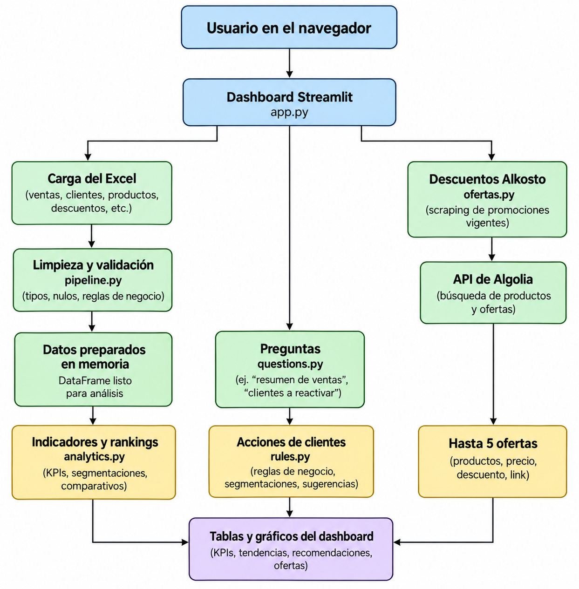

## Solución

aplicacion, los datos cargados desde Excel son limpiados y validados antes de calcular indicadores, 
rankings y acciones sugeridas para clientes.

Adicionalmente, la aplicación permite realizar preguntas sobre la información
del negocio y consultar ofertas vigentes de empresa hermana Alkosto mediante su servicio de
búsqueda.

  

https://inteligencia-comercial-alkomprar.streamlit.app/
